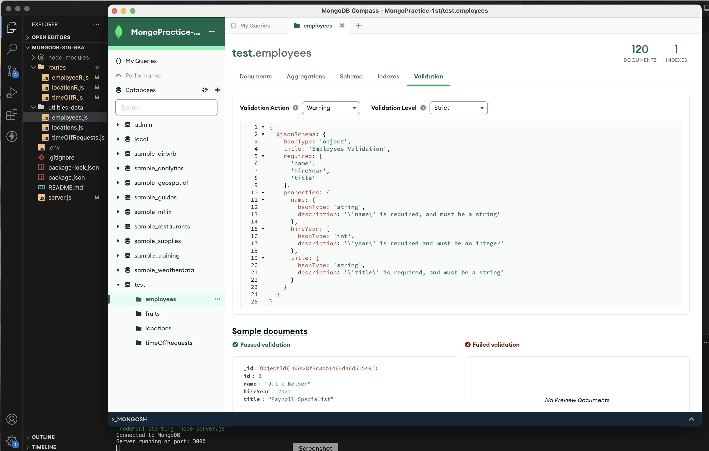

# MongoDB Database Application

This is a small Node.js, Express, and MongoDB server application that manages employees' time-off requests.

## Objectives

<ul>
<li>Create a server application with Node, Express, and MongoDB.</li>
<li>Create a CRUD API using Express and MongoDB.</li>
<li>Create MongoDB indexes.</li>
<li>Use MongoDB indexing to make efficient queries.</li>
<li>Create MongoDB validation rules.</li>
<li>Use MongoDB validation to ensure data consistency.</li>
</ul>

## Usage

<ol>
<li>Clone this repository.</li>
<li>Install dependencies using `npm install`.</li>
<li>Create a `.env` file with the following content:</li>
    <ul>
        <li>PORT=3000</li>
        <li>ATLAS_URI="your_mongodb_atlas_uri"</li>
    </ul>
<li>Replace `your_mongodb_atlas_uri` with your MongoDB Atlas URI.</li>
<li>Start the server using `node server.js`.</li>
</ol>

## Data Validation

